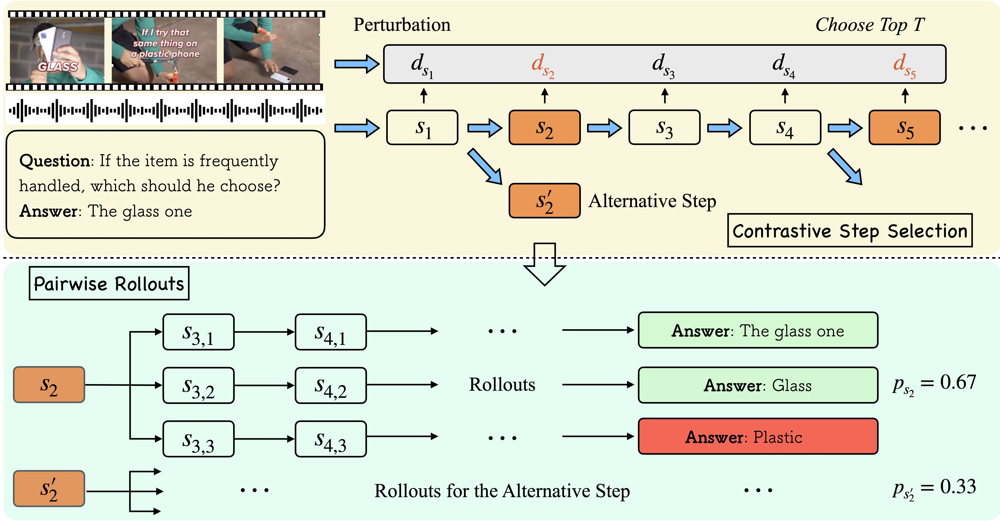

# video-SALMONN-o1

## Abstract
While recent advancements in reasoning optimization have significantly enhanced the capabilities of large language models (LLM), existing efforts to improve reasoning have been limited to solving mathematical problems and focusing on visual graphical inputs, neglecting broader applications in general video understanding.
This paper proposes video-SALMONN-o1, the first open-source reasoning-enhanced audio-visual LLM designed for general video understanding tasks. To enhance its reasoning abilities, we develop a reasoning-intensive dataset featuring challenging audio-visual questions with step-by-step solutions. We also propose the process direct preference optimization (DPO), which leverages contrastive step selection to achieve efficient step-level reward modeling tailored for multimodal inputs. 
Additionally, we introduce AVRBench, the first comprehensive audio-visual reasoning benchmark, featuring over 4,000 high-quality, expert-curated question-answer pairs across scenarios such as standup comedy, academic presentations, and synthetic video detection. video-SALMONN-o1 achieves 3-8% accuracy improvements over the LLaVA-OneVision baseline across different video reasoning benchmarks. Besides, process DPO achieves 6-8% improvements compared to the SFT-only model. Furthermore, enhanced reasoning enables video-SALMONN-o1 zero-shot synthetic video detection capabilities.

### Process DPO and Contrastive Rollout

## RivaBench Demo Samples
---
[Medical Example](video/medical_example_clip.mp4)

**Question**:
How does the twin study isolate TBI's impact on dementia risk? Choose from:\
A. By analyzing twins with inconsistent timing of onset of TBI and dementia.\
B. By excluding early life exposures from the study.\
C. By observing the progression of dementia in twins without TBI.\
D. By ensuring differences in dementia risk are due to TBI.\
E. By focusing only on Alzheimer's dementia outcomes.\

**Answer**
A. By analyzing twins with inconsistent timing of onset of TBI and dementia.

**Explain**:
The increased risk of "all-cause dementia" and "non-Alzheimer's dementia" mentioned in the slides suggests an association between TBI and an increased risk of dementia, particularly non-Alzheimer's type dementia.

To further test whether this association is causal, the researchers may have employed a variety of methods, including adjusting for confounders and using statistical techniques such as propensity score matching. With these methods, they can enhance the reliability of the findings and allow us to conclude with more confidence that TBI does indeed increase the risk of dementia.

Taken together, the twin study effectively isolated the effect of TBI on dementia risk by controlling for genetic and early life risk factors. By analyzing inconsistent pairs, researchers can more accurately assess the association between TBI and dementia, thereby providing a scientific basis for prevention and intervention.

---
[Math Example](video/math_example_clip.mp4)

**Question**:
Using Euler's method, compute y at x1, x2, and x3 for y' = x + y, y(0) = 1, h = 0.1? Choose from:\
A. y(x1) $\approx$ 1.1, y(x2) $\approx$ 1.22, y(x3) $\approx$ 1.362\
B. y(x1) $\approx$ 1.1, y(x2) $\approx$ 1.19, y(x3) $\approx$ 1.281\
C. By(x1) $\approx$ 1.05, y(x2) $\approx$ 1.11, y(x3) $\approx$ 1.165\
D. y(x1) $\approx$ 0.9, y(x2) $\approx$ 0.99, y(x3) $\approx$ 1.088\
E. y(x1) $\approx$ 1.2, y(x2) $\approx$ 1.33, y(x3) $\approx$ 1.473

**Answer**
A. y(x1) $\approx$ 1.1, y(x2) $\approx$ 1.22, y(x3) $\approx$ 1.362

**Explain**:
Euler's method is a numerical method to solve first-order ordinary differential equations (ODEs) with a given initial value. The method provides an approximation to the solution of the ODE at a series of points.

The formula for Euler's method is:
$y_{n+1} = y_n + h \cdot f(n, y_n)$
Where:
$y_{n+1}$ is the approximation of the solution at the next step. $y_n$ is the current approximation. $h$ is the step size. $f(n, y)$ is the derivative of the function at the current point. Given the differential equation:
$y' = x + y$

With the initial condition:
$y(0) = 1$

And a step size:
$h = 0.1$

We will compute the values of $y$ at $x_1 = 0.1$, $x_2 = 0.2$, and $x_3 = 0.3$.

__Step 1__: Compute $y_1$ at $x_1 = 0.1$

Initial condition: $y_0 = 1$ at $x_0 = 0$. $f(x_0, y_0) = x_0 + y_0 = 0 + 1 = 1$. $y_1 = y_0 + h \cdot f(x_0, y_0) = 1 + 0.1 \cdot 1 = 1.1$

__Step 2__: Compute $y_2$ at $x_2 = 0.2$

$y_1 = 1.1$ at $x_1 = 0.1$. $f(x_1, y_1) = x_1 + y_1 = 0.1 + 1.1 = 1.2$. $y_2 = y_1 + h \cdot f(x_1, y_1) = 1.1 + 0.1 \cdot 1.2 = 1.22$

__Step 3__: Compute $y_3$ at $x_3 = 0.3$

$y_2 = 1.22$ at $x_2 = 0.2$. $f(x_2, y_2) = x_2 + y_2 = 0.2 + 1.22 = 1.42$. $y_3 = y_2 + h \cdot f(x_2, y_2) = 1.22 + 0.1 \cdot 1.42 = 1.362$

__Final Approximations__

$y_1 \approx 1.1$ at $x_1 = 0.1$. $y_2 \approx 1.22$ at $x_2 = 0.2$. $y_3 \approx 1.362$ at $x_3 = 0.3$.

## Demo Videos
---
[Figure 13 Video](video/standup_1.mp4)

**Question**:
What does the speaker imply by saying he 'didn't need to know that' at the end of the video? Choose from:\
A. He regrets ordering so much food.\
B. When you want to eat, just eat and don't prioritize calories.\
C. He doesn't like knowing calorie counts of food.\
D. He feels guilty about his food choices.\
E. The calorie count was surprisingly low.\
Answer the question step by step. Output each thinking step. 

**Reasoning**:
1. The The speaker is making a joke about how fast food restaurants use calorie counts to manipulate customers into buying more food.
2. He says he didn't need to know that because he already knew he was going to eat a lot of calories.
3. His tone and delivery suggest he's not actually upset about the calorie count, but rather finds it humorous that he doesn't need to be told how unhealthy his choices are. (Combining audio-visual information)
4. Therefore, the speaker implies that when you want to eat, just eat and don't prioritize calories.
5. The answer is B

---
[Figure 14 Video](video/videomme_1.mp4)

**Question**:
What is on the legend when he is hit by the turret? Choose from:\
A. Sand.\
B. Ice.\
C. Thunder.\
D. Fire.\
Answer the question step by step.

**Reasoning**:
1. The question asks about the legend when he is hit by the turret.
2. The legend is a character in the game, and turrets are structures that fire at characters.
3. The legend is hit by a turret at around 0:15 seconds into the video.
4. When the legend is hit by the turret, there is a burst of fire.
5. Therefore, the answer is **D. Fire**.

---
[Figure 15 Video](video/videomme_2.mp4)

**Question**:
Which of the following elements does not appear in the video? Choose from:\
A. Iceberg.\
B. Moon.\
C. Earth.\
D. River.\
Answer the question step by step.

**Reasoning**:
1. The question asks which element is not present in the video.
2. We need to carefully watch the video and identify all the elements shown.
3. The video shows various natural landscapes like mountains, waterfalls, forests, deserts, oceans, and a view from space.
4. However, the video does not show the moon.
5. Therefore, the answer is **B. Moon**.

---
[Figure 16 Video](video/synth_1.mp4)

**Question**:
An AI-generated video contains unnatural distorted things, such as distorted hands or faces. Is the given video AI generated? Answer YES or NO. Answer step by step and output each step clearly.

**Reasoning**:
1. The video shows a man running towards a train, then collapsing in pain. 
2. The background is blurred and the colors are distorted, suggesting motion blur.
3. AI-generated videos often use techniques like motion blur to create a sense of speed or urgency. 
4. This can sometimes result in unnatural distortions in the image.
5. In this case, the blurring and distortion are more pronounced than what would be expected from natural camera shake or movement. 
6. The hands of the man appear particularly distorted, which is not typical for real-life footage.
7. Therefore, based on the visual cues of the video, it is likely that the video is AI generated. 
8. So the answer is YES.

---
[Figure 17 Video](video/synth_2.mp4)

**Question**:
An AI-generated video contains unnatural distorted things, such as distorted hands or faces. Is the given video AI generated? Answer YES or NO. Answer step by step and output each step clearly.

**Reasoning**:
1. The video shows a cyclist riding on a road with a field of flowers in the background. 
2. The colors are vibrant and the scene is smooth, suggesting it might be AI generated.
3. Upon closer inspection, we can see that the cyclist's shadow is perfectly aligned with the cyclist, which is unusual for a moving object. This suggests a lack of natural motion blur or distortion, a common characteristic of AI-generated videos.
4. Therefore, based on the smoothness of the scene and the unnatural alignment of the cyclist's shadow, it is highly likely that the video is AI generated. 
5. So the answer is YES.

## Model Checkpoint
Coming soon...

## Training
Coming soon...

## Inference
Coming soon...
